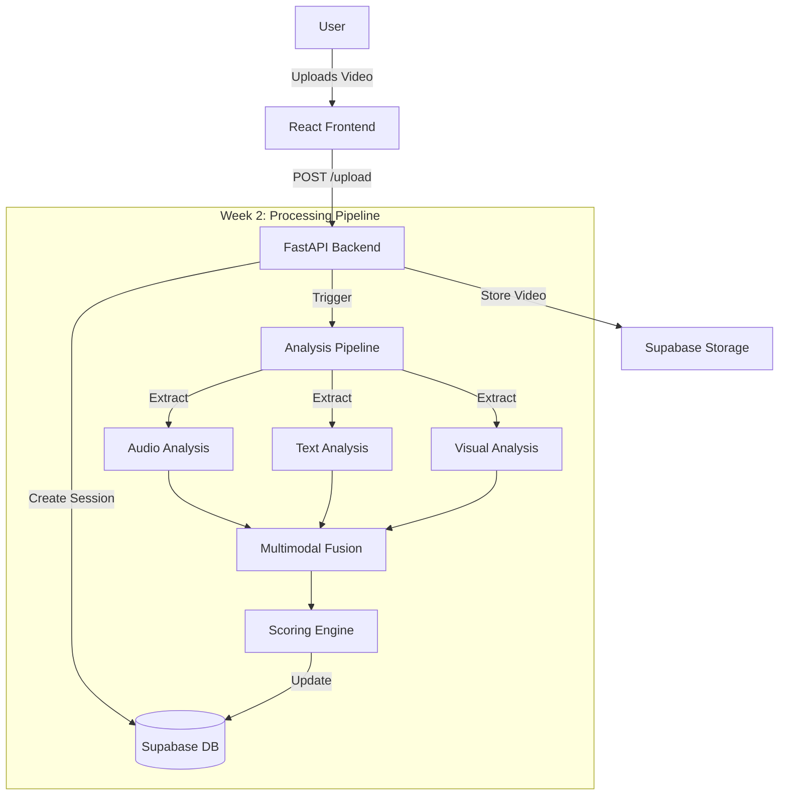

# System Architecture

## High-Level Diagram

## Data Flow

1. **Upload**: User uploads a video via the frontend.
2. **Storage**: Video is stored in Supabase Storage.
3. **Session Creation**: A session record is created in the database with status `uploaded`.
4. **Processing (Week 2)**: The backend triggers the analysis pipeline.
5. **Analysis (Week 2)**: Audio, text, and visual features are extracted and analyzed.
6. **Fusion & Scoring (Week 2)**: Multimodal data is fused to generate a teaching quality score.
7. **Reporting (Week 3)**: Results are stored and displayed on the dashboard.

## Tech Stack

- **Frontend**: React, Vite, Tailwind CSS
- **Backend**: FastAPI, Python
- **Database**: Supabase (PostgreSQL)
- **Storage**: Supabase Storage
- **ML/AI**: PyTorch, Transformers (Week 2)
